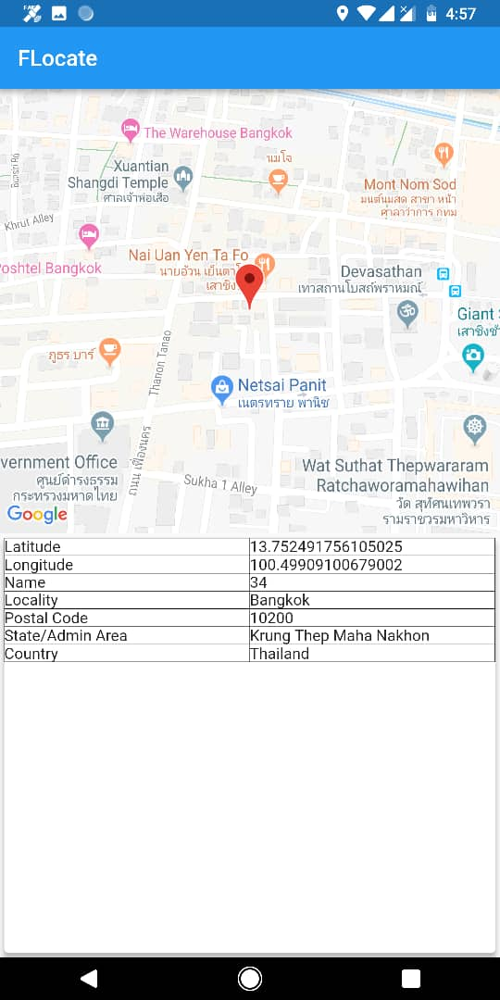
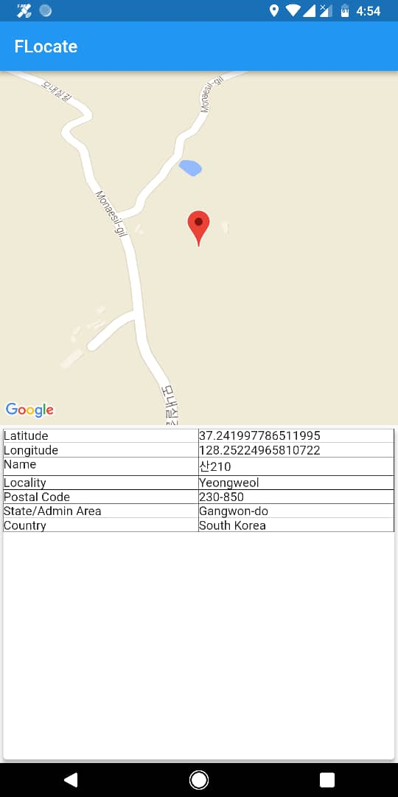

# FLocate

A location detector app based on my old [Locate!](https://play.google.com/store/apps/details?id=us.lyrae.app.locateme&hl=en_CA) app.

This app uses newly-published [Flutter Google Map plugin](https://pub.dartlang.org/packages/google_maps_flutter) so expect to have some substantial changes soon. 

## Screenshots

  

## To-do
- [ ] Redesign UI
- [ ] Refactoring codes into classes 
- [ ] Add sharing function  
